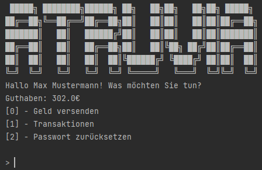

# Atruvia Internship Project - Banking Client

  
 

This is a small project I made at Atruvia, during my one week internship, where we had one day to make a Java application. This is also my first real java project.
An exciting challenge to code, was the user password system, since it is hashed with SHA256 and salted.

## Features
- Login
- View balance
- Send money
- View last five transactions
- Change password
- Logout

### The user login for the sample account is:
Username: Max Mustermann
Password: passwort123
